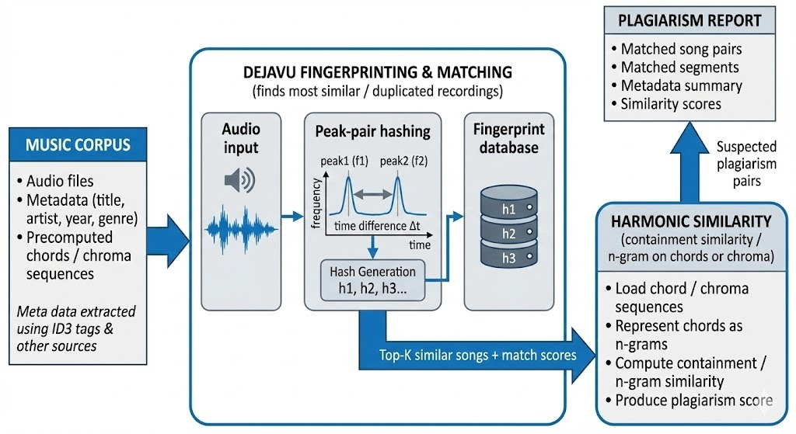

# AUDIO DUPLICATION AND PLAGIARISM DETECTION

---

## Project Architecture

---

## Dataset

The primary dataset used:

- **GTZAN Music Genre Classification Dataset**  
  [https://www.kaggle.com/datasets/andradaolteanu/gtzan-dataset-music-genre-classification](https://www.kaggle.com/datasets/andradaolteanu/gtzan-dataset-music-genre-classification)

Additional self-created datasets for chord analysis:

- [Samsung 5th Nov Dataset](https://www.kaggle.com/datasets/girijageddavalasa/samsung5thnov)
- [Sample 4 Dataset](https://www.kaggle.com/datasets/girijageddavalasa/sample4)

---

## 0Corpus — Audio Corpus Management

A comprehensive audio corpus pipeline standardizes **data ingestion, metadata extraction, and lifecycle tracking** for all audio files within the system.

**Key Features:**

- Automated technical analysis: sample rate, channels, encoding subtype, duration, bitrate, compression ratio.
- File integrity: SHA256 fingerprinting for duplication checks.
- Metadata capture: dataset name, source type, reference URLs.
- Full provenance and version tracking with an SQLite-backed schema.
- Structured logging and audit trails for all corpus modifications.

This foundation ensures **reliability, scalability, and traceability** for large-scale audio analysis workflows, supporting future integration into AI-driven similarity search and plagiarism detection modules.

---

## 1Duplication — Fingerprinting & Chroma Analysis

Chroma (Librosa-based):

Chroma represents what notes are played over time in an audio file, regardless of how fast or slow the song is. It converts sound into 12 pitch classes (C to B) and creates a “chromagram” — a heatmap showing which notes are active at each time. Because it focuses on pitch content and not timing, it can still recognize a song even if the playback speed changes or small edits are made.

Dejavu (Fingerprinting):

Dejavu identifies specific recordings by finding unique “spectral peaks” — strong frequency points in the spectrogram. It turns these into compact digital fingerprints (hashes) that can be stored and compared quickly. This makes it great for detecting exact or nearly identical copies, even if the volume or quality changes.

Working Together:

Chroma = detects similar musical content (good for tempo-changed or edited versions).

Dejavu = detects exact or near-exact matches (good for duplicate detection).
Together, they let the project find both identical copies and speed-modified or slightly altered versions of the same song.

---

## 2Plagiarism_Similarity — MIDI & Chord Matching

MIDI conversion enables the extraction of **chords and harmonic progression** from tracks for higher-level similarity analysis.

- Tested chord-level clustering using self-curated datasets.
- Experiments performed in:
  - `tryingcompatibilityforall` notebook → cluster prediction
  - `finalreport` notebook → similarity testing
- Current similarity methods:
  - **Containment similarity**
  - **n-gram based similarity** (variable _n_)
- Planned upgrade: **WER (Word Error Rate)** for accuracy-based comparison.

MIDI and chord embeddings enhance cross-song similarity detection even across genre or arrangement differences.
